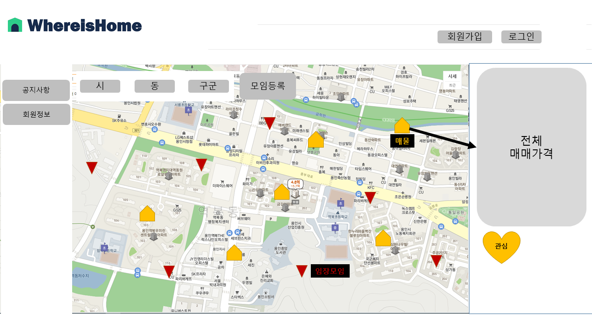
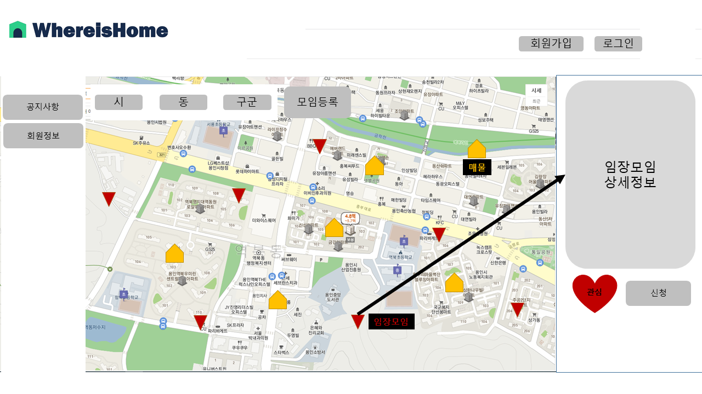
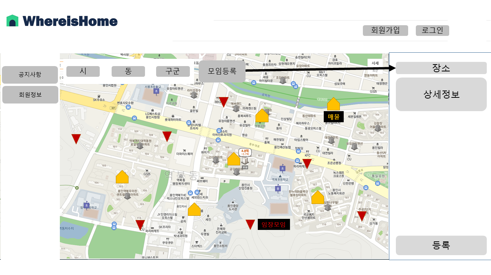
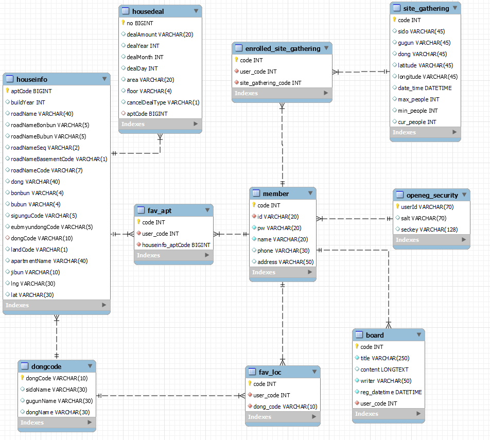

# 22.11.16

내용: 뷰 제출용
복습1: No
복습2: No

# 0. 주제

- 임장 모임

# 1. 기능적 요구사항

| 1   | 사용자관리 | 로그인                 | DB에 유저 정보가 있는지 확인 후 로그인                    |
| --- | ---------- | ---------------------- | --------------------------------------------------------- |
|     |            | 회원관리               | 회원정보 가입 ,수정, 탈퇴                                 |
|     |            | 관심 매물 보기         | 관심 등록했던 매물 보기                                   |
|     |            | 관심 임장모임 보기     | 관심 등록했던 임장모임 보기                               |
|     | 추가       | 카카오 로그인          | 카카오 로그인 API를 이용하여서 로그인                     |
|     |            | 비밀번호 암호화        | 회원 가입시 salt를 사용하여 암호화한 비밀번호를 DB에 저장 |
|     |            | 회원가입 입력패턴 검수 | 입력 정보별 정해진 규칙을 안내하고 검수                   |
|     |            | 회원가입 입력 검수     | 전달받은 데이터를 서버에서 검수 후 처리                   |
|     |            |                        |                                                           |

| 2   | 주택 실거래 | 검색               | 주택 실거래가 정보를 원하는 검색 정보에 따라 그 지역의 매물 검색 결과 데이터 제공 |
| --- | ----------- | ------------------ | --------------------------------------------------------------------------------- |
|     |             | 상세보기           | 특정 매물에 대한 상세 정보 제공                                                   |
|     |             | 관심 매물 등록(\*) | 검색 후 내가 관심이 있는 매물들 체크해서 등록 가능                                |
|     | 보안        |                    |                                                                                   |

| 3   | 임장모임 | 검색               | 임장모임 정보를 원하는 검색 정보에 따라 그 지역의 임장모임의 검색 결과 데이터 제공 |
| --- | -------- | ------------------ | ---------------------------------------------------------------------------------- |
|     |          | 상세보기           | 특정 임장모임에 대한 상세 정보 제공                                                |
|     |          | 관심 모임 등록(\*) | 검색 후 내가 관심이 있는 임장모임을 체크해서 등록 가능                             |
|     |          | 신청(\*)           | 특정 임장 모임에 참석 신청                                                         |
|     |          | 등록(\*)           | 특정 지역에 임장 모임 개설                                                         |

| 4   | 게시판 | 글쓰기(\*)    | 게시판에 글 등록            |
| --- | ------ | ------------- | --------------------------- |
|     |        | 글리스트 보기 | 게시판의 글 리스트 보여주기 |
|     |        | 상세보기(\*)  | 게시판에 등록된 글 상세보기 |

( \* 이 기능은 로그인을 한 사용자만 사용 가능합니다.)

# 2. 비기능적 요구사항

| #   | 요구사항명           | 요구사항 상세                     |
| --- | -------------------- | --------------------------------- |
| 1   | 공공데이터의 정확성  | API로 가져온 데이터의 정확성 체크 |
| 2   | XSS 방어             | Lucy Filter를 활용하여 방어       |
| 4   | 사용자 데이터 암호화 | aes                               |
| 5   | 사용자 인증          | csrf                              |
| 6   | 2차인증              | 데이터 수정 삭제 시 2차 인증 요구 |
| 7   | 데이터 출력 최소화   | colsole.log, sysout 제거          |

# 3. 화면설계

# 4. 아키텍쳐 다이어그램

# 5. 테이블 구조도(ERD)

- 임장 테이블 구성 요소

  - 임장 모임 고유 코드(인덱스)
  - 시도
  - 구군
  - 동
  - 위도
  - 경도
  - 날짜, 시간
  - 최대 인원
  - 최소 인원
  - 현재 인원

- 유저 테이블 구성 요소

  - 유저 고유 코드(인덱스)
  - 아이디
  - 패스워드
  - 이름
  - 주소(시도)
  - 주소(구군)
  - 주소(동)

- 관심 매물 테이블

  - 유저 코드
  - 관심 매물 코드

- 관심 지역 테이블

  - 유저 코드
  - 동코드

- 신청한 임장 모임 테이블
  - 유저 코드
  - 신청한 임장 고유코드

포린키 설정 방법

- 프라이머리키 아닌 테이블의 속성에서 프라이머리키인 테이블의 속성으로

